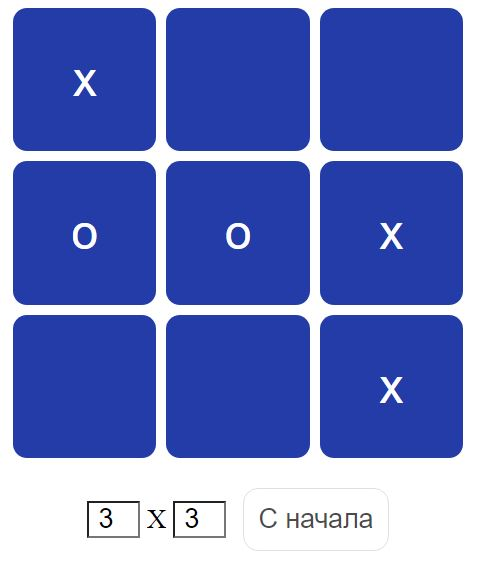

# Популярная игра крестики-нолики

## Игру можно открыть по [адресу](https://stepan-ko.github.io/tic-tac-toe/ "https://stepan-ko.github.io/tic-tac-toe/") 

## Возможно менять размерность поля от 2х2 до 7х7

### Применил на практике:
- Условные конструкции Javascript
- Использование многомерных массивов
- Использование циклов for()
- Оборачивание кода в отдельные функции
- Использование области видимости переменных
- Работа с DOM-элементами
- Динамическая вёрстка на основе GRIG
  

  
